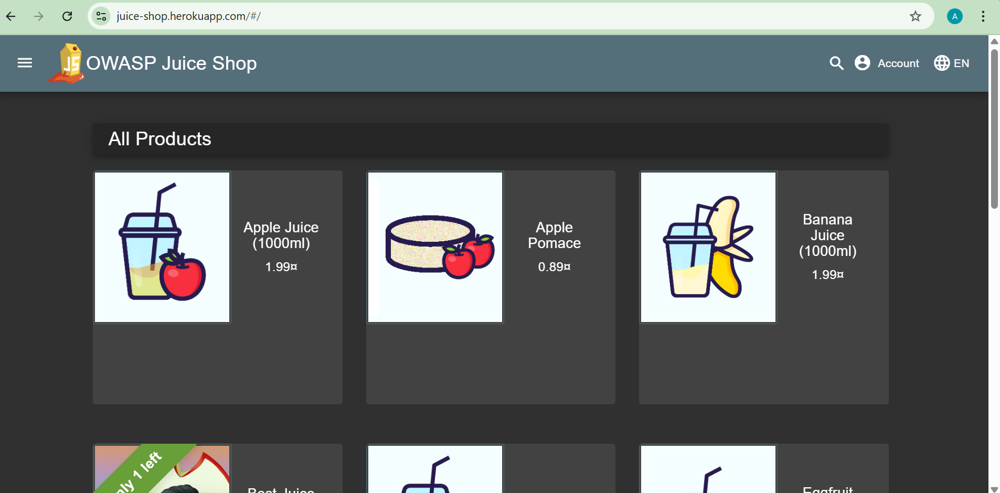
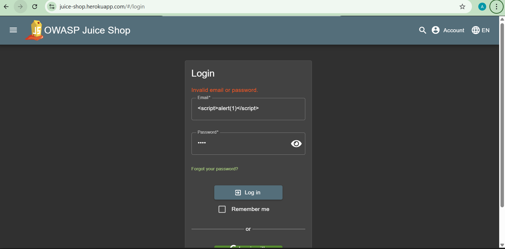
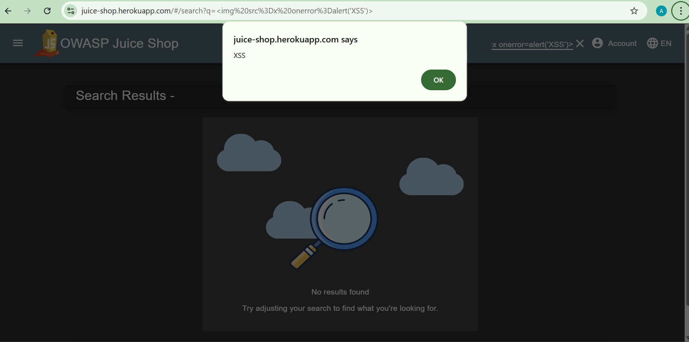
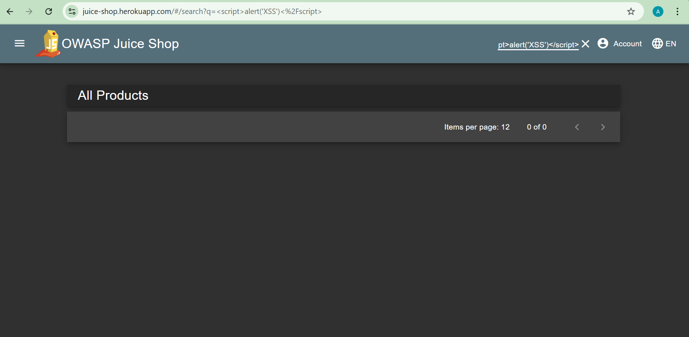

# 🔐 XSS Testing on OWASP Juice Shop

## 📌 Project Overview

This project demonstrates **Cross-Site Scripting (XSS) vulnerability testing** performed on the OWASP Juice Shop application.
The objective was to identify input fields, test payloads, and analyze how the application handles malicious scripts.

---

## 🎯 Objective

* Identify user input fields in the application
* Test common XSS payloads
* Observe application behavior against script injection
* Understand input validation and output encoding mechanisms

---

## 🛠 Tools & Technologies Used

* OWASP Juice Shop
* Google Chrome (Browser)
* Developer Tools (F12)

---

## 🔍 Input Fields Identified

* Search Bar
* Login Form (Email & Password)

---

## 💣 Payloads Used

```html
<script>alert('XSS')</script>

```

---

## ⚙️ Testing Procedure

### Step 1: Access Application

* Opened OWASP Juice Shop in browser
* Explored UI to identify input fields

### Step 2: Test Search Field

* Injected XSS payloads into search bar
* Observed application response

### Step 3: Test Login Form

* Entered payloads in email field
* Checked for script execution or validation errors

---


## 📸 Screenshots

### Homepage


### Login


### XSS Payload Testing


### XSS Payload Testing



---

## 📊 Results

| Sr No | Input Field | Payload                            | Result       |
| ----- | ----------- | ---------------------------------- | ------------ |
| 1     | Search Bar  | `<script>alert('XSS')</script>`    | Not Executed |
| 2     | Search Bar  | `` | Executed     |
| 3     | Login Form  | `<script>alert(1)</script>`        | Not Executed |

---

## 🔎 Observations

* Some inputs are **properly sanitized and encoded**
* Basic script injection is blocked in certain fields
* However, alternative payloads (like `onerror`) may still execute

---

## ⚠️ Security Insight

The application demonstrates **partial protection against XSS attacks**.
While basic payloads are filtered, certain vectors still bypass input validation, highlighting the need for stronger sanitization and secure coding practices.

---

## ✅ Conclusion

This project highlights the importance of **input validation and output encoding** in preventing XSS vulnerabilities.
It also demonstrates how different payloads can bypass weak filters, emphasizing the need for comprehensive security testing.

---

## 📁 Project Structure

```
OWASP-Juice-Shop-XSS-Testing/
│── README.md
│── XSS_Testing_Report.pdf
│── screenshots/
│    ├── identified-fields.png
│    ├── xss-test.png
│    └── login-test.png
```

---

## 🚀 Future Improvements

* Test for **Stored XSS and DOM-based XSS**
* Use tools like Burp Suite for advanced testing
* Automate payload testing using scripts

---

## 👨‍💻 Author

**Abhishek Yewale**
Cybersecurity Enthusiast | Penetration Testing Learner
